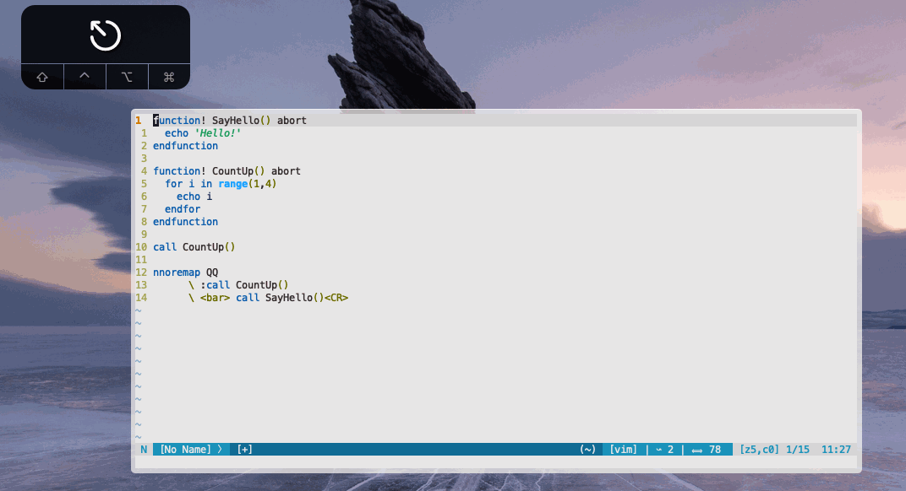

# vim-visualrun: select some lines and run them as a Vim command
## Why?
I like how in Emacs you can run Lisp from anywhere.
So this lets you run Vim commands from anywhere.

## What?
This plugin lets you visually select a range of lines and then run them as Vim commands.

The plugin exposes one visual mode mapping:

* `<Plug>VisualRunCommands`: run the visually selected lines as Vim commands

There are no default mappings (by design, so as not to force mappings on users), so you need to map this `<Plug>` yourself.
For example, by putting this line in your .vimrc: `vmap <silent> <leader><cr> <Plug>VisualRunCommands`.

**Disclaimer:** this code is not extensively tested.
It works for me, running Vim 8.2 in the terminal on macOS, but it's not guaranteed to work for others.
It might not work in Neovim, as I don't use Neovim.
